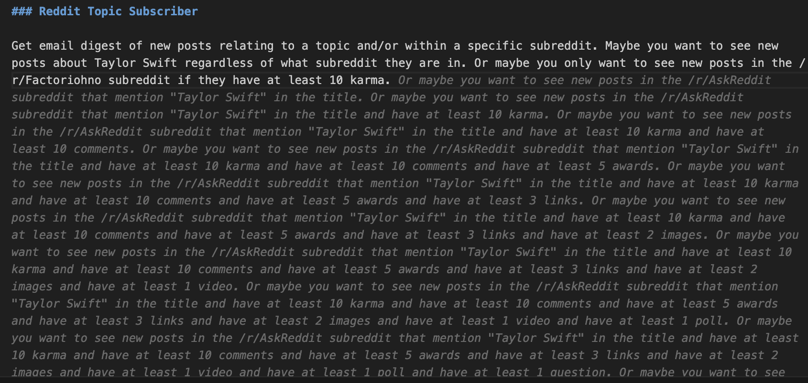

# Ask Reddit (Without Asking Reddit)

This is a web application that uses the power of (so-called) "Artificial Intelligence" (dubious!) to query Reddit and summarize the content of posts in order to "answer" questions.

If your goal is to actually find answers to questions using Reddit, you are better off just doing a Google search. But this web app is a moderately cute product of Resume Driven Development (guilty as charged), and it has a frontend and a backend and features and stuff. I might add more things to it later (see the Fantasy Land section below).

# Requirements

This app requires credentials to authenticate to the Reddit API and the OpenAI API. Reddit authentication uses OAuth 2.0, which you can learn more about [here](https://github.com/reddit-archive/reddit/wiki/OAuth2). OpenAI authentication uses an API key, which you can obtain by signing up for an account on the OpenAI website.

Run `make setup-env` to create `backend/.env` file, which will contain secrets and other configs. Replace the default values when prompted, or just go modify the .env file later, obviously.


## Docker

This app is designed to be run in Docker. To start the app, fire up Docker and then run:

```shell
make build
```

Wow that was so easy! Love me a good Makefile. But what is `make build` actually doing? It is running these commands:
  
```shell
docker compose run frontend npm i
docker-compose up --build
```

Why all the MADNESS? This app uses Vite, which has a known issue with installing Rollup. The workaround for this is to run `npm i` in the frontend directory before starting the app. I don't make the rules.


## Without Docker

It can be useful to run parts of the app outside of Docker for development. Here's how you can run the app without Docker.

Start the backend in a virtual environment.

```shell
cd backend
source .env
python3 -m venv .venv
source .venv/bin/activate
flask run
```

To start the frontend:

```shell
cd frontend
npm run dev
```

# Fantasy Land 

Here's a smattering of ideas I have for new features or tweaks to add to this project. It's not really that serious, but could be fun to play with some of these:

- [ ] Set up a local LLM with ollama
- [ ] Enable app to be run with ollama OR with OpenAI API based on config
- [ ] Add a button enabling the user to fetch more posts to incorporate into the summary
- [ ] Add a text box for the user to ask follow up questions to the AI
- [ ] Even Smarter Search: Some way of executing multiple queries and combining the results to answer a question
- [ ] Group the top posts by topic
- [ ] Add user management and enable a logged in user to save queries and results (how crazy would it be to implement google auth?)
- [ ] Use the Pushshift API to enable including comments in search results (Reddit API only supports searching top-level posts)
- [ ] Add a scheduler to collect data at regular intervals
- [ ] Add more features to the data collection (e.g. collect comments, more metadata)
- [ ] Add data analysis and visualization

Some additional ideas for larger spin-off projects:

## Reddit Image Search

Something like Google Image Search, but specifically using Reddit posts? Fetch posts with screenshots and displays those screenshots in the UI, with captions based on the content of the post. Or something.

## Reddit Topic Subscriber

Get email digest of new posts relating to a topic and/or within a specific subreddit. Maybe you want to see new posts about Taylor Swift regardless of what subreddit they are in. Or maybe you only want to see new posts in the /r/Factoriohno subreddit if they have at least 10 karma.

FUN BONUS CONTENT: Github Copilot is losing it.



## Reddit Scraper

Set up some search params, enter a CRON schedule, hit "go", and let the app scrape Reddit for you, running at regular intervals to collect new relevant posts and add them to a database. Optionally enable files to be written to local database or to a cloud storage service (S3, GCS).